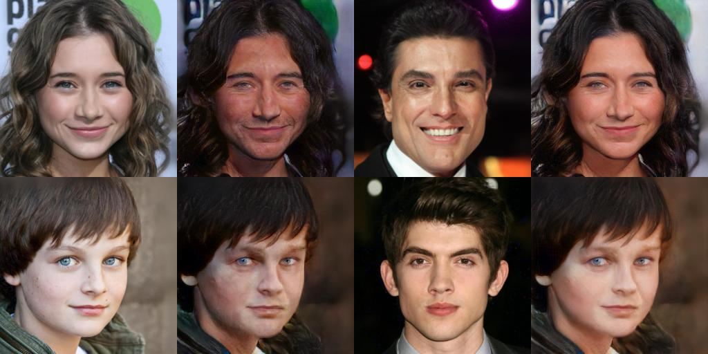

<p align="center"></p>

--------------------------------------------------------------------------------
Unofficial PyTorch implementation of [StarGAN-v2](https://arxiv.org/abs/1711.09020).<br/>

This repository is forked from Official StarGAN PyTorch v1.0 and add new features to the model according to Paper StarGAN v2.
 StarGAN can flexibly translate an input image to any desired target domain using only a single generator and a discriminator.

<p align="center"></p>

<br/>

## Paper
[StarGAN v2: Diverse Image Synthesis for Multiple Domains](https://arxiv.org/abs/1711.09020) <br/>

[Yunjey Choi](https://github.com/yunjey), [Jung-Woo Ha](https://www.facebook.com/jungwoo.ha.921)   <br/>
 </sup>Clova AI Research (NAVER Corp.)   <br/>
IEEE Conference on Computer Vision and Pattern Recognition ([CVPR](http://cvpr2018.thecvf.com/)), 2020 

<br/>

## Dependencies
* [Python 3.5+](https://www.continuum.io/downloads)
* [PyTorch 1.0.0+](http://pytorch.org/)
* [TensorFlow 1.3+](https://www.tensorflow.org/) (optional for tensorboard)


<br/>

## Usage

### 1. Cloning the repository
```bash
$ git clone https://github.com/habout632/StarGAN2.git
$ cd StarGAN/
```

### 2. Dataset Structure
you need to arrange your images as [torchvision Suggested ImageFolder](https://pytorch.org/tutorials/beginner/data_loading_tutorial.html) in the following way , 
for example, afhq：

```bash
root/ants/xxx.png
root/ants/xxy.jpeg
root/ants/xxz.png
.
.
.
root/bees/123.jpg
root/bees/nsdf3.png
root/bees/asd932_.png
```
where ‘ants’, ‘bees’ etc. are class labels.

### 3. Training
To train StarGAN on dataset(CelebA-HQ, AFHQ or any other your own custom dataset, run the training script below. See [here](https://github.com/yunjey/StarGAN/blob/master/jpg/CelebA.md) for a list of selectable attributes in the CelebA dataset. If you change the `selected_attrs` argument, you should also change the `c_dim` argument accordingly.

```bash
$ python main.py --mode train --batch_size 2 --image_size 256 --num_domains 2 --beta1 0 \
                 --beta2 0.99 --g_conv_dim 32 --num_iters 900000 --resume_iters 600000 \
                 --sample_dir /data2/starganv2/celeba/samples --model_save_dir /data2/starganv2/celeba/models \
                 --result_dir /data2/starganv2/celeba/results --image_dir /data/datasets/celeba-hq/train                  
```

### 4. Testing

To test StarGAN v2 on dataset:

```bash
$ python main.py --mode test --dataset CelebA --image_size 128 --c_dim 5 \
                 --sample_dir stargan_celeba/samples --log_dir stargan_celeba/logs \
                 --model_save_dir stargan_celeba/models --result_dir stargan_celeba/results \
                 --selected_attrs Black_Hair Blond_Hair Brown_Hair Male Young
```

### 5. Pretrained model
Once finished training on celebhq, we will publish the pretrained model.The Pretrained model will be provided in two ways:
Google Drive
Baidu Disk 
To download a pretrained model checkpoint, run the script below. The pretrained model checkpoint will be downloaded and saved into `./stargan_celeba_256/models` directory.

```bash
$ bash download.sh pretrained-celeba-256x256
```

To translate images using the pretrained model, run the evaluation script below. The translated images will be saved into `./stargan_celeba_256/results` directory.

```bash
$ python main.py --mode test --dataset CelebA --image_size 256 --c_dim 5 \
                 --selected_attrs Black_Hair Blond_Hair Brown_Hair Male Young \
                 --model_save_dir='stargan_celeba_256/models' \
                 --result_dir='stargan_celeba_256/results'
```

<br/>

## Results

### 1. Latent Guided Image Generation on CelebA-HQ
<p align="center"></p>

### 2. Latent Guided Image Generation on CelebA-HQ
<p align="center"></p>

### 3. Reference Guided Image Generation on CelebA-HQ, work still in progress
<p align="center"></p>


<br/>

<br/>

## Acknowledgement
This work was mainly inspired by [StarGAN_v2-Tensorflow](https://github.com/taki0112/StarGAN_v2-Tensorflow), appreciate helping of the author [Junho Kim](https://github.com/taki0112)


## Contribution
we still need your help, as we stuck on reference guided image synthesis and computing resources(multiple gpus training), any contribution(demos, code and the docs)is welcomed 
